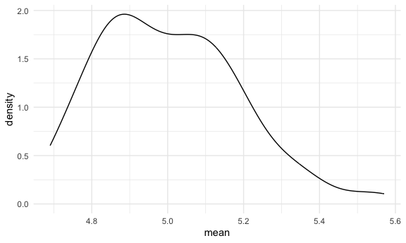
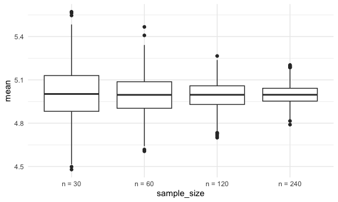

Simulation
================

## Simulate sample mean and sd

``` r
sim_mean_sd = function(n_obs, mu = 5, sigma = 1) {
  x_vec = rnorm(n = n_obs, mean = mu, sd = sigma)
  
tibble(
    mean = mean(x_vec), 
    sd = sd(x_vec)
  )
}
```

Lets see what this function does

``` r
sim_mean_sd(n_obs = 30)
```

    ## # A tibble: 1 × 2
    ##    mean    sd
    ##   <dbl> <dbl>
    ## 1  4.77  1.04

Lets iterate this function to see how its behaving under REPEATED
SAMPLING!!!

``` r
output = vector("list", length = 100)

for (i in 1:100) {
  output[[i]] = sim_mean_sd(n_obs = 30)
}


sim_results = 
  bind_rows(output)

view(sim_results)

sim_results %>% 
  ggplot(aes(x = mean)) + geom_density()
```



``` r
sim_results %>% 
  summarize(
    mu_hat = mean(mean),
    sd_hat = sd(mean)
  )
```

    ## # A tibble: 1 × 2
    ##   mu_hat sd_hat
    ##    <dbl>  <dbl>
    ## 1   5.00  0.185

Use a Map function

``` r
sim_results_df = 
  expand_grid(
    sample_size = c(30, 60, 120, 240),
    iter = 1:1000
  ) %>% 
  mutate(estimate_df = map(sample_size, sim_mean_sd)) %>% 
           unnest(estimate_df)
 
view(sim_results_df) 

sim_results_df %>% 
  mutate(
    sample_size = str_c("n = ", sample_size),
    sample_size = fct_inorder(sample_size)
  ) %>% 
  ggplot(aes(x = sample_size, y = mean)) +
  geom_boxplot()
```


